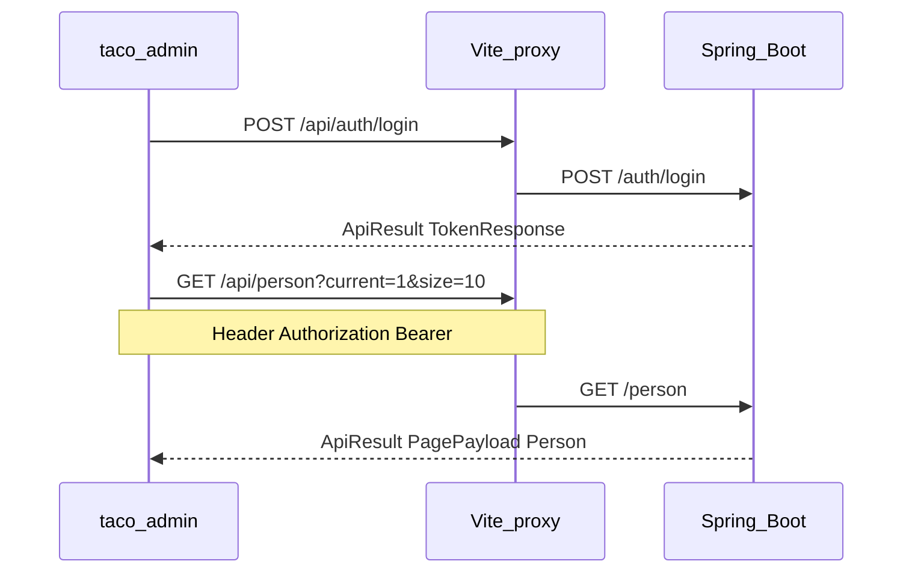

# taco-admin：Vercel 风格框架 + 人物管理

## 后端与契约（无需改 Controller）

- **人物 API**（`[PersonController.java](src/main/java/io/github/deantook/taco/controller/PersonController.java)`）：
  - `GET /person?current=&size=` → `ApiResult<PagePayload<Person>>`，分页默认 `current=1`、`size=10`（上限 100），见 `[PageQuery.java](src/main/java/io/github/deantook/taco/common/PageQuery.java)`。
  - `GET /person/{id}`、`POST /person`、`PUT /person/{id}`、`DELETE /person/{id}`。
- **统一响应** `[ApiResult](src/main/java/io/github/deantook/taco/common/ApiResult.java)`：`code === 0` 为成功；失败时带 `code`/`message`。
- **认证** `[SecurityConfig.java](src/main/java/io/github/deantook/taco/config/SecurityConfig.java)`：除 `/auth/register`、`/auth/login` 外均需登录；JWT 放在请求头 `Authorization: Bearer <token>`（`[JwtAuthenticationFilter](src/main/java/io/github/deantook/taco/security/JwtAuthenticationFilter.java)`）。
- **登录** `[AuthController](src/main/java/io/github/deantook/taco/controller/AuthController.java)`：`POST /auth/login`，body 为 `login` + `password`（`[LoginRequest](src/main/java/io/github/deantook/taco/dto/auth/LoginRequest.java)`），返回 `[TokenResponse](src/main/java/io/github/deantook/taco/dto/auth/TokenResponse.java)`（含 `token`）。

因此前端必须包含 **登录与 Token 持久化**，否则人物接口会 401。

## 联调方式（避免浏览器 CORS）

- 在 `[taco-admin/vite.config.ts](taco-admin/vite.config.ts)` 增加 **dev proxy**：例如将 `/api` 转发到 `http://localhost:8080`，并重写去掉 `/api` 前缀，使前端请求统一为 `fetch('/api/person', ...)`（同源，无 CORS）。
- 生产环境可通过环境变量 `VITE_API_BASE` 指向真实后端；若前后端不同源，需在 Spring 侧增加 **CORS**（可后续在 `application.yaml` 配 `allowed-origins` + `WebMvcConfigurer`/`CorsConfigurationSource`）。本阶段以 **代理 + 可选 CORS 说明** 为主，避免阻塞本地开发。

## UI 方向：「Vercel 控制台」气质（不引入重型组件库）

- **字体**：使用 [Geist](https://vercel.com/font)（npm `geist` 或 CDN），标题/正文区分字重。
- **视觉**：中性灰背景、细边框（如 `border-black/8`）、小圆角（约 `6px`）、少装饰、表格与侧栏留白充足；支持 **浅色主色 + 系统/用户可切换暗色**（用 `class` 切换 + CSS 变量即可）。
- **结构**：
  - 左侧 **窄侧栏**：Logo/名称、导航项「人物」等占位。
  - 顶栏：当前页标题、用户区（可调用 `GET /auth/me` 展示昵称，需带 Token）。
  - 主区：人物列表页。

不强制使用 shadcn/Geist UI 组件库，以免一次生成大量文件；用 **Tailwind + 少量本地封装**（`Button`/`Input`/`Card`）即可达到相近质感。

## 前端实现要点

| 模块              | 内容                                                                                                                                                      |
| --------------- | ------------------------------------------------------------------------------------------------------------------------------------------------------- |
| 依赖              | `react-router-dom`、`tailwindcss`（及 Vite 集成）、`lucide-react`（图标）、可选 `geist` 字体包                                                                           |
| 类型              | `ApiResult<T>`、`PagePayload<T>`、与 `[Person](src/main/java/io/github/deantook/taco/domain/Person.java)` 对齐的 TS 类型（`aliases`/`gender` 可为 `unknown` 或宽松类型） |
| `api/client.ts` | `baseURL` 来自 `import.meta.env.VITE_API_BASE ?? ''`；自动附加 `Authorization`；解析 JSON 后若 `code !== 0` 抛错带 `message`                                           |
| 路由              | `/login` 公开；`/` 或 `/person` 需登录；未登录跳转登录                                                                                                                 |
| 登录页             | 表单 → `POST /auth/login` → 存 `token`（建议 `localStorage`）→ 跳转人物页                                                                                           |
| 人物页             | 表格 + 分页控件（绑定 `current`/`size` 与 `PagePayload.total/pages`）；行内编辑/删除；「新建」打开侧滑面板或 Modal                                                                    |
| 表单字段            | 优先：`name`（必填）、`originalName`、`avatar`、`bio`、`birthDate`（`input type="date"`，提交 ISO 字符串；若后端 `Date` 序列化为时间戳，再在 client 做兼容）                                |
| 复杂字段            | `aliases`（JSON）、`gender`（Object）第一版可用 **多行文本/原始 JSON** 或先隐藏，避免阻塞 MVP                                                                                    |

## 数据流（简图）

## 文件与目录（建议）

- 调整入口样式：`[taco-admin/src/index.css](taco-admin/src/index.css)`、替换 `[App.tsx](taco-admin/src/App.tsx)` 为 `RouterProvider`/`Routes`。
- 新增例如：`src/layouts/AdminLayout.tsx`、`src/pages/LoginPage.tsx`、`src/pages/person/PersonPage.tsx`、`src/api/*`、`src/types/*`、`src/auth/AuthContext.tsx`（或简单 hook）。
- 按需精简/删除默认 Vite 欢迎页资源（`[App.css](taco-admin/src/App.css)` 等），避免冗余。

## 风险与注意

- `**java.util.Date` JSON 形态**：若表现为数字时间戳，前端展示时 `new Date(n)`；若为字符串则直接解析。列表里做一层 `formatDate` 即可。
- **数据库与凭证**：`[application.yaml](src/main/resources/application.yaml)` 含远程库密码，勿提交到公开仓库；与本任务无关但需知悉。

## 实施顺序建议

1. 配置 Tailwind + Geist + 全局 CSS 变量（Vercel 风底栏/侧栏壳）。
2. 实现 `api/client`、登录页、Token 存储与受保护路由。
3. 配置 Vite 代理并打通 `GET /person` 列表。
4. 实现分页、新建、编辑、删除与错误提示（toast 或行内文案即可）。

