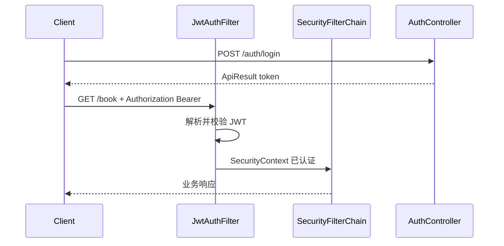

# 用户认证（注册 / 登录 / 全站 JWT）实现计划

## 现状摘要

- 依赖：[pom.xml](pom.xml) 仅有 Web、MyBatis-Plus、MySQL；**无** Spring Security、无校验 starter。
- 数据：[init.sql](src/main/resources/init.sql) 已定义 `user` 表（`username`、`email`、`password_hash`、`status` 等）；实体 [User.java](src/main/java/io/github/deantook/taco/domain/User.java) 中 `status` 为 `Object`，与 MySQL ENUM 不匹配，需在实现认证时改为枚举或 `String` 并保证 MyBatis 映射正确。
- API 风格：统一 [ApiResult](src/main/java/io/github/deantook/taco/common/ApiResult.java) + [ResultCode](src/main/java/io/github/deantook/taco/common/ResultCode.java)；控制器示例见 [BookController.java](src/main/java/io/github/deantook/taco/controller/BookController.java)。
- 路径：内容为 `/book`、`/movie` 等，**无** `/api` 前缀；认证路径建议与现有风格一致，使用 `**/auth/`****（与「除 auth 外全保护」一致）。

## 架构示意

## 1. Maven 依赖

在 [pom.xml](pom.xml) 增加：

- `spring-boot-starter-security`
- `spring-boot-starter-validation`（注册/登录 DTO 使用 `@NotBlank`、`@Email`、`@Size` 等）
- JJWT 0.12.x：`jjwt-api`、`jjwt-impl`（runtime）、`jjwt-jackson`（runtime）

## 2. 配置项

在 [application.yaml](src/main/resources/application.yaml) 增加 JWT 相关配置（示例键名）：

- `jwt.secret`：HS256 密钥，**长度需满足算法要求**（建议 ≥ 32 字节随机串）；生产环境用环境变量覆盖，**勿把真实密钥提交到仓库**。
- `jwt.expiration-ms`：访问令牌过期时间（如 24h）。

可一并把现有数据库账号密码改为 `${...}` 占位，与 JWT 密钥同理，避免明文入库（实现时按你当前习惯最小改动即可）。

## 3. 领域与错误码

- **User.status**：改为 `enum`（如 `ACTIVE`、`DISABLED`）并对应 DB 值 `active`/`disabled`，或使用 `String` + 常量；删除 `Object` 类型，避免序列化/映射问题。
- **ResultCode**：扩展业务码，例如：`UNAUTHORIZED(40101)`、`FORBIDDEN(40301)`、`USER_ALREADY_EXISTS(40901)`、`INVALID_CREDENTIALS(40002)` 等，供注册/登录失败与鉴权失败时返回 `ApiResult.fail(...)`。

## 4. JWT 与 Spring Security

| 组件                                 | 职责                                                                                                                                                                                           |
| ---------------------------------- | -------------------------------------------------------------------------------------------------------------------------------------------------------------------------------------------- |
| `JwtService`（或 `JwtTokenProvider`） | 生成/解析 JWT；claims 至少包含 `sub`（用户 id）或 `username`，便于后续鉴权                                                                                                                                        |
| `JwtAuthenticationFilter`          | 从 `Authorization: Bearer <token>` 解析 JWT，校验后构造 `UsernamePasswordAuthenticationToken` 写入 `SecurityContext`                                                                                    |
| `SecurityConfig`                   | `csrf` 关闭；`session` 设为 `STATELESS`；`**requestMatchers("/auth/**").permitAll()`**，`**anyRequest().authenticated()`**；注册 `JwtAuthenticationFilter` 在 `UsernamePasswordAuthenticationFilter` 之前 |
| `PasswordEncoder`                  | `BCryptPasswordEncoder` Bean                                                                                                                                                                 |

**登录方式**：建议登录请求体支持「用户名或邮箱 + 密码」：服务层用 MyBatis-Plus `lambdaQuery` 按 `username` 或 `email` 查唯一用户，再 `passwordEncoder.matches` 校验 `password_hash`。

**禁用用户**：若 `status != active`，登录直接失败（业务码区分于密码错误，避免用户枚举时可统一文案，按产品要求二选一）。

## 5. 注册与登录 API

新建 `AuthController`，路径示例：

- `POST /auth/register`：body `{ username, email, password }` — 校验唯一性、BCrypt 哈希后写入 `user`，**响应不返回密码与哈希**；成功后可直接返回 `ApiResult.ok(简要用户信息)` 或 `ApiResult.ok()`，由你偏好决定；若希望注册后立即可访问受保护接口，可**同登录一样返回 JWT**（减少一次请求）。
- `POST /auth/login`：body `{ usernameOrEmail, password }`（字段名可简化为 `login` + `password`）— 校验通过后签发 JWT，返回 `ApiResult` 包装 `{ token, tokenType: "Bearer", expiresIn }` 及可选公开用户信息。

DTO 使用 `jakarta.validation` 注解；校验失败由 `**@ControllerAdvice` + `MethodArgumentNotValidException`** 转为 `ApiResult` + `BAD_REQUEST`，与现有风格一致。

## 6. 鉴权失败与业务异常

- **未带 Token / Token 无效 / 过期**：Spring Security 入口点返回 **401**，body 建议统一为 `ApiResult` + `UNAUTHORIZED`（需自定义 `AuthenticationEntryPoint`）。
- **已登录但权限不足**（若后续加角色）：403 + `FORBIDDEN`（可选 `AccessDeniedHandler`）。

当前需求为「全站 JWT」，主要实现 **401 统一 JSON** 即可。

## 7. 受保护接口与前端行为

按你的选择：**除 `/auth/`** 外所有路径均需已认证**。影响：

- 浏览器/客户端访问 `/book` 等必须先调用 `/auth/login`（或注册接口若返回 token）拿到 JWT，后续请求头带 `Authorization: Bearer ...`。
- 若存在 Swagger 或 BFF，需在计划中注明后续加 **Swagger + Security 配置**（本次可不做，除非你需要）。

## 8. 可选：当前用户辅助

新增 `GET /auth/me`（需认证）：从 `SecurityContext` 取当前用户 id，查询并返回脱敏后的 `User`（无 `passwordHash`），便于前端展示与联调。**该路径不属于 `permitAll`**，属于「接口认证」能力的直接体现。

实现方式：在 Filter 中把 `userId` 放入 `Authentication` 的 details，或自定义 `UserPrincipal` 实现 `UserDetails`。

## 9. 测试建议（实现后）

- 无 Token 访问 `GET /book` → 401。
- 注册 → 登录拿 Token → 带 Token 访问 `GET /book` → 200。
- 错误密码登录 → 业务失败码与 `ApiResult` 一致。

## 关键文件清单（将新增/修改）

| 操作  | 路径                                                                                                                                                                                                                             |
| --- | ------------------------------------------------------------------------------------------------------------------------------------------------------------------------------------------------------------------------------ |
| 修改  | [pom.xml](pom.xml)、[application.yaml](src/main/resources/application.yaml)、[User.java](src/main/java/io/github/deantook/taco/domain/User.java)、[ResultCode.java](src/main/java/io/github/deantook/taco/common/ResultCode.java) |
| 新增  | `config/SecurityConfig.java`、`security/JwtAuthenticationFilter.java`、`jwt/JwtService.java`（包名可按项目惯例放在 `io.github.deantook.taco` 下）                                                                                             |
| 新增  | `controller/AuthController.java`、`dto`（注册/登录请求与响应）、`service/AuthService`（或直接在 Controller 调 `UserService` + `JwtService`，保持薄控制器）                                                                                                |
| 新增  | `exception/GlobalExceptionHandler.java`（校验异常 + 可选）                                                                                                                                                                             |

---

**说明**：[user.sql](src/main/resources/user.sql) 中业务表通过 FK 引用 `user(id)`，与本次认证无冲突；无需改表结构，除非后续要加「刷新令牌表」等（本方案不包含 refresh token）。